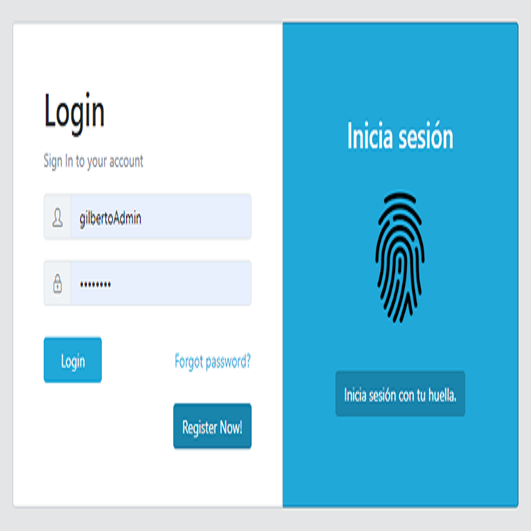
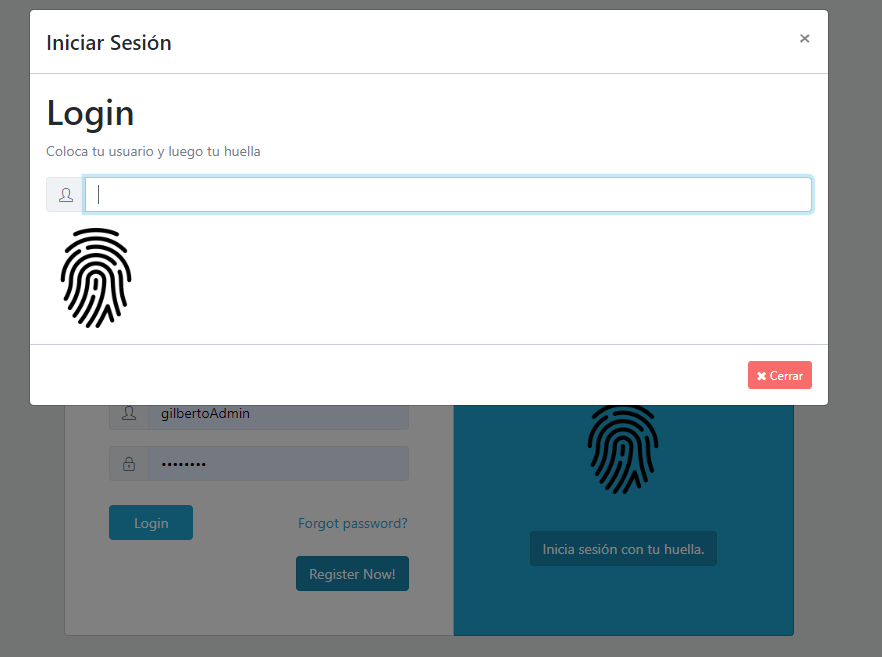
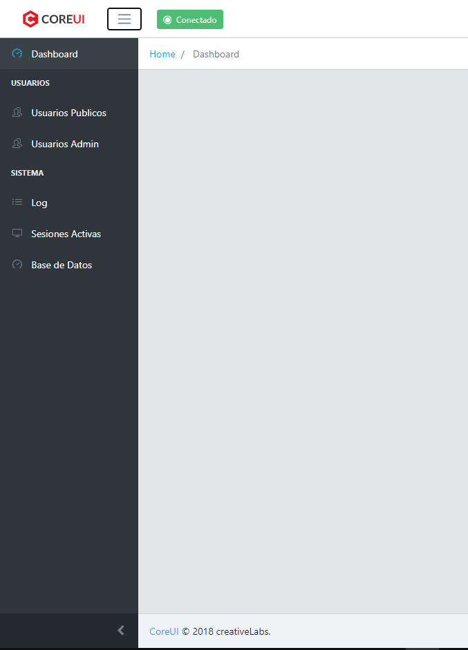
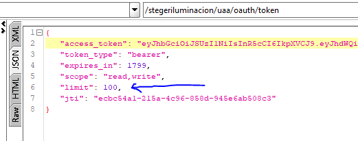
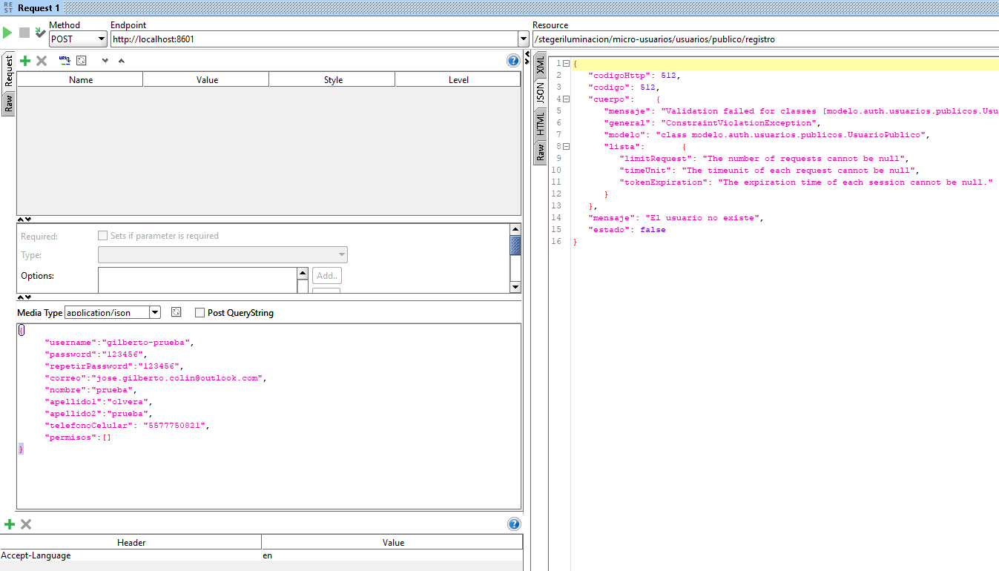
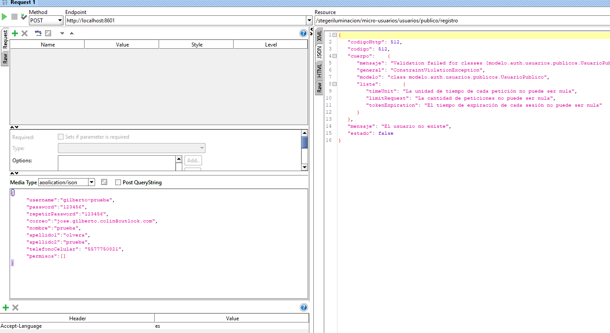

# Template Implementación UAREU 4500 + SDK en JAVA 

Una plantilla creada en Spring boot con multiples librerias integradas - plantilla base

```
NOTA: Esta plantilla contiene el SDK y RTE de U.ARE.U 4500.
```

<div align="center">
    </img> 
</div>
 
<div align="center">
    </img> 
    </img> 
    </img> 
</div> 
 
 
## Librerias implementadas
 - Spring-boot
	- spring-boot-starter . 2.1.8.RELEASE
	- spring-boot-starter-web 
	- spring-security-oauth2 
	- spring-security-oauth2-autoconfigure
	- spring-boot-starter-security
	- spring-boot-starter-mail
	- spring-boot-starter-thymeleaf
	- mysql-connector-java
	- HikariCP
	- springfox-swagger2
	- spring-boot-starter-websocket
	- spring-boot-starter-validation
	- lombok
	- uareu


## Características especiales de esta plantilla
  - spring-security 
	- JWT – Esta librería implementa Token de seguridad a nivel de base de datos, quiere decir que está preparada para ir a producción.
	- Validación de inicio de sesión – Esta plantilla implementa un inicio de sesión customizado (Revisa que el usuario este activo, etc.…)
	- Inicio de sesión con huella – También se puede iniciar sesión con huella usando el dispositivo U.ARE.U 4500 (implementado a nivel web), además de guardar tus huellas en base de datos y no en el dispositivo
	- JWT Encriptado – Los Tokens generados son generados con un certificado de encriptación (. jks), RSA para mayor seguridad
		```
			{  
			"alg": "RS256",  
			"typ": "JWT"  
			}  
		```
	- Expiración de Token customizada por usuario - Con esta forma de generación de token, podremos hacer que cada usuario tenga una expiración de token diferente, además de usar Throttling en los usuarios públicos.
	- Throttling podemos también definir el límite de peticiones por Tiempo en cada usuario.
	- Control de Endpoint – Se implementa una forma de roles y permisos para toda la aplicación tanto a nivel FrontEnd como Backend.

  - Idioma (i18n)
	- Como es sabido un solo idioma no será suficiente para grandes proyectos, por eso se decidió incluir multiidioma en esta plantilla, además de que no solo tendríamos un buen manejo de múltiples idiomas sino también tendríamos un buen manejo de todos los mensajes de nuestra plataforma en un solo lugar.
	- Nivel de idioma a nivel de modelo de datos y a nivel aplicación

  - Validaciones a nivel de modelo

	- En esta plantilla se usó JPA validación, para validar los modelos del sistema, está ligado al idioma ya que las validaciones contienen mensajes, esto también se hizo multi-idioma.

  - Log

	- Se implementa un Log a nivel peticiones generales, para monitoreo de seguridad de cada petición.
  - Swagger 2.0

	- Se implementó un (documentador) para toda la API del sistema

  - Websocket (Notificaciones en tiempo real)
	- Se implementó un websocket para notificaciones en tiempo real.
  - Base de datos
	- Para la persistencia de datos se implementó JPA 2.0
  - Modelo MVC
	- Para el flujo de información se implementó el modelo MVC
  - Mejores Prácticas de programación
	- Se implementaron las mejores prácticas de programación, así como algunos patrones de diseño (DAO, DTO)
  - Manejo de excepciones a nivel Global
	- Se implementó un manejador de excepciones a nivel global para excepciones controladas y no controladas
  - Correo
	- Envió de correo para el registro de un nuevo usuario formado con HTML.
  - Front End 
	- El FrontEnd está completamente en Angular 8
	- Integración nativa del dispositivo U.ARE.U 4500
	- Template By Core Ui versión gratuita.

## Estructura del proyecto

El proyecto esta construido con maven , es un proyecto monolitico.

Dentro de tu proyecto e la carpeta \TheUltimateMonoliticTemplate ejecuta el siguiente comando:
```
mvn clean install
```
Para compilarlo y haga una descarga de todas las librerias del mismo.
 
## Como compilar el proyecto
  - paso 1:  Descarga el proyecto con Git
  ``` 
    git clone https://github.com/JoseGilberth/TheUltimateMonoliticTemplate.git
	-- SE DESBLOQUEA UNA VEZ MOSTRADA LA COMPRA
  ```
  - paso 2:  Ve a la carpeta de descarga y dentro de la carpeta \TheUltimateMonoliticTemplate , ejecuta lo siguiente
  ``` 
    mvn clean install 
  ```
 - paso 3: Crea una base de datos en MYSQL , llamada "template" , con codificación UTF-8 y utf8_general_ci
 
 - paso 4: Por default si inicias el proyecto tomara el perfil "dev" el cual ya tiene configurado un usuario y un password "root" - "G1lb3rt0." asi que iniciara la creacion de las tablas en la base de datos (cambia tus credenciales en properties.yml)

## Puertos usados en la plantilla

- http://localhost:8080 -- SPRING BOOT
- http://localhost:8080 -- Websocket 
 
| Servicio | Puerto |
| ------------- | ------------- |
| /  |   8080  |
| /websocket  |  8080  | 


### Seguridad ###

Dentro de las configuraciones para la generacion de tokens, se agrego un certificado para que la generación de token sea más segura, asi que se modifico el Bean "accessTokenConverter()" 

``` 
	 hiden code..
  ```

Los archivos que se usaron para la seguridad del token se encuentran en recursos dentro de la carpeta de recursos.

<div align="center">
    </img> 
</div> 
  
- ELIMINA JKS DE CERTIFICADOS SI YA EXISTEN 
 ```
keytool -delete -alias template -keystore "path/template.jks" -storepass G1lb3rt0. -keypass gilberto 
 ```
 ```
keytool -delete -alias template -v -trustcacerts -keystore cacerts.jks -storepass G1lb3rt0. -keypass gilberto
 ```
- GENERAR JKS 
 ```
keytool -genkey -alias template -keyalg RSA -keypass gilberto -storepass G1lb3rt0. -keystore "Path/template.jks"
 ```
- PUBLIC - PEM , CER , TEXT 
 ```
keytool -export -alias template -keystore "path/template.jks" -file "path/template-public-key.pem" -storepass G1lb3rt0. -keypass gilberto 
 ```
  ```
keytool -export -alias template -keystore "path/template.jks" -file "path template-public-key.cer" -storepass G1lb3rt0. -keypass gilberto 
 ```
```
keytool -list -alias template -rfc -keystore "path/template.jks" -storepass G1lb3rt0. -keypass gilberto
 ```
- IMPORT JKS A CERTIFICADOS DE CONFIANZA
 ```
keytool -import -alias template -v -trustcacerts -file "path template-public-key.cer" -keystore cacerts.jks -keypass gilberto -storepass G1lb3rt0.
 ```

Los comandos anteriores nos sirvieron para eliminar , crear y dar de alta un certificados jks,pem,cer etc.. 

para que asi obtengamos al final un token con firma RS256.

<div align="center">
     
</div>

#### Configuración a nivel base de datos ####

Tanto la configuración de clientes como los token son guardados a nivel base de datos y no a nivel memoria interna

```
	@Resource(name = "cliente")
	private ClientDetailsService clientes;
 
	@Override
	public void configure(ClientDetailsServiceConfigurer configurer) throws Exception {
		configurer.withClientDetails(clientes);
	}
```

```
	@Bean
	public TokenStore tokenStore() {
		return new JdbcTokenStore(this.dataSource);
	}
```

#### Expiración de token a nivel usuario ####

Con esta forma de generación de token, podremos hacer que cada usuario tenga una expiración de token diferente, ademas de usar **Throttling** en los usuarios publicos, con el uso de **Throttling** podemos tambien definir el limite de peticiones por Tiempo en cada usuario , mas abajo se muestra la configuración.

```
	 hiden code..
```
Esta configuración nos permite tambien agregar información adicional a nuestro token, que de hecho solo se aplica el Throttling a usuarios publicos

<div align="center">
     
</div>


#### Throttling ####

Esta configuración, nos permitira mantener el control de cada uno de los token logeados, la configuración en si esta montada sobre "PreFilter"

```
	@Autowired
	 hiden code..
```

Primero hay que tener en cuenta dos cosas , al menos en esta configuración de plantilla tenemos dos tipos de "authorization" , la primera que es cuando un usuario solicita un token y la siguiente cuando el mismo token es enviado al servicio para posteriormente ser validado por los "Recursos" del servicio del que se requiere.

- Authorization Basic <-Base64->
- Authorization Bearer <-Token->

Bueno dicho lo anterior lo que se hace es un simple filtro , si el token contiene Basic o Bearer ,
y dependiendo de cual tenga pues procesara el token en caso de ser bearer y dejara pasar la peticion en caso de se basic.

Cuando la peticion contenga bearer entonces decodifica el token , y busca al usuario a travez de el, si encuentra al usuario lo serializo en un json y lo guardo como si fuera una llave, para despues aplicar Throttling a ese usuario y contabilizar sus request que le quedan a ese token , de momento el Throttling no esta bajo base de datos por lo que si llegaras a reiniciar el servidor de gateway entonces reiniciarias los conteos del Throttling.
 
#### Idioma ####

Como es sabido un solo idioma no sera suficiente para grandes proyectos , por eso se decidio incluir multiidioma en esta plantilla , ademas de que no solo tendriamos un buen manejo de multiples idiomas sino tambien tendriamos un buen manejo de todos los mensajes de nuestra plataforma en un solo lugar , hay alguna partes de la plantilla que necesitaran una revisada ya que muchas cosas estan hardcodeadas y hay que implementarles el "Translation"

Para esta fase de idiomas se implementarón 2 funciones principales

- Idioma al enviar excepciones 
- Idioma al validar los modelos de datos

Para la primera configuración es necesario implementar un bean y extender a la clase AcceptHeaderLocaleResolver 
para que todas nuestras peticiones que enviemos con el header: 
- Accept-Language: en 
- Accept-Language: es 
- etc.....

cambien el idioma en automatico

```
	 hiden code..
```

Para esta configuración ahora ser aun poco tediosa , ya que las validaciones en JPA tambien deben modificarse y no es suficiente con la configuración de arriba.

Asi que lo mejor fue implementar directamente nuestro custom y ese custom agregarlo a las propiedades HIBERNATE,
"javax.persistence.validation.factory"

``` 
	// TRADUCCION Y MANEJO DE MENSAJES DESDE EL MODELO CON JPA
	 hiden code..
```

Ahora todo esto se hace para que tu puedas tener esto en el modelo de datos y pueda cambiar tambien de idioma:

```
	 hiden code..
```

Y ahora podemos recibir las validaciones del modelo en el idioma solicitado

<div align="center">
    </img> 
</div>

<div align="center">
    </img> 
</div> 

 

