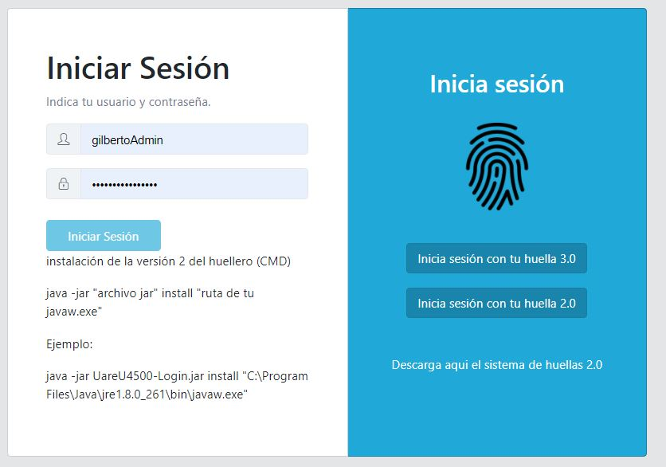
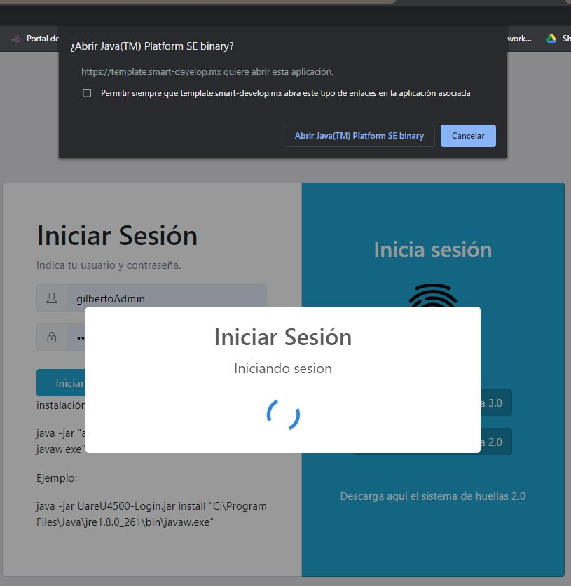
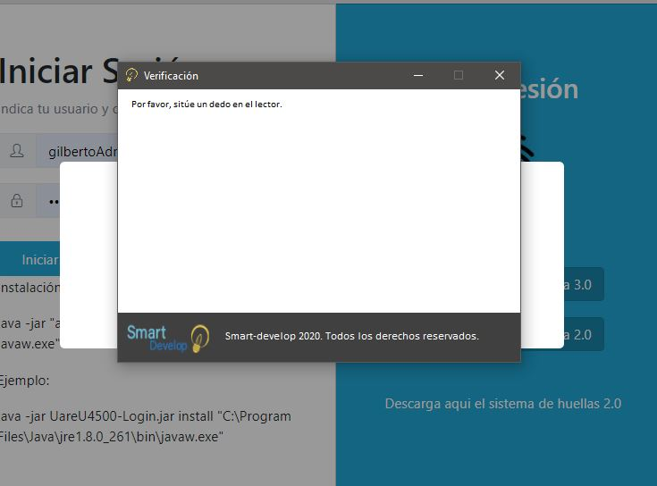
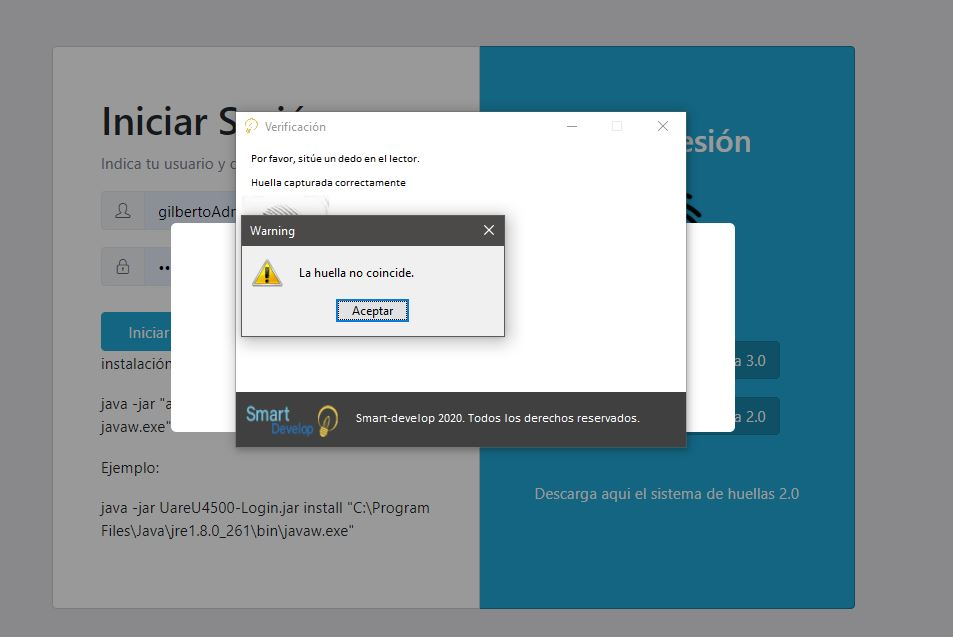
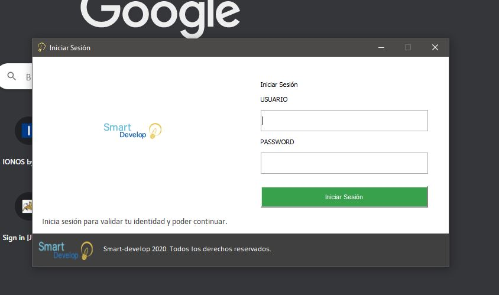
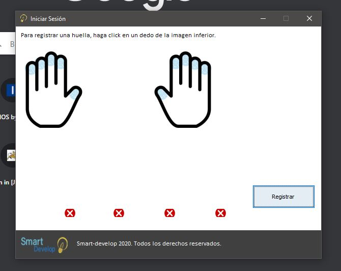
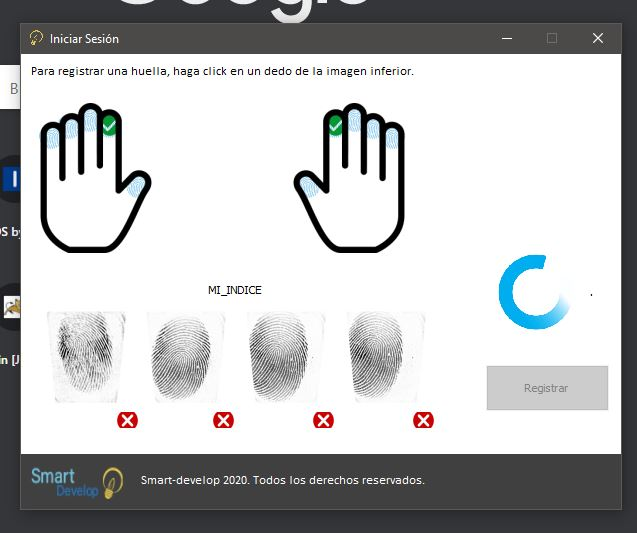
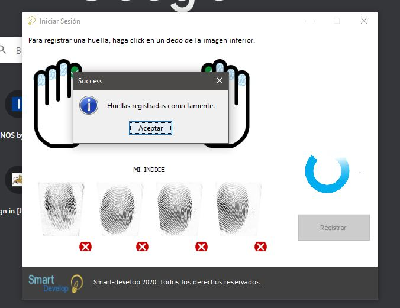

# Template Implementación UAREU 4500 V2 en JAVA 

Una plantilla creada en Spring boot con multiples librerias integradas - plantilla base

```
NOTA: Esta plantilla contiene el RTE de U.ARE.U 4500. v2.3
```

Compra
https://articulo.mercadolibre.com.mx/MLM-806818515-codigo-fuente-de-integracion-web-uareu-4500-v2-java-_JM

<div align="center">
    </img> 
</div>
 
<div align="center">
    </img> 
    </img> 
    </img> 
    </img> 
    </img> 
    </img> 
    </img> 
    </img> 
</div> 

**INSTALACION DEL HUELLERO**

- Necesitas el JRE de java >= 7
- Necesitas el sistema de huellero , lo descargas de aca 
https://template.smart-develop.mx/#/login
en donde dice "Descarga aqui el sistema de huellas 2.0"
Te va a descargar un jar
- Busca la ruta hacia tu archivo javaw.exe (en mi caso = "C:\Program Files\Java\jre1.8.0_261\bin\javaw.exe")
- Abre CMD el modo ADMINISTRADOR
- El comando de instalacion es el siguiente:
    - java -jar "archivo jar" install "ruta de tu javaw.exe" 
- Un ejemplo seria: 
    - java -jar UareU4500-Login.jar install "C:\Program Files\Java\jre1.8.0_261\bin\javaw.exe"
- Cuando en el CMD diga que todo esta correcto y termine, tienes que registrar tus huellas, para ello pon esto en tu navegador como si fuera una url de pagina web:

    - smartdevelop://registroService?usuario=demodemo
&basic=dGVtcGxhdGU6MTIz
&loginUrl=https://smart-develop.mx:8443/template/oauth/token
&callback=https://smart-develop.mx:8443/template/usuarios/admin/update/externo/huellas
- Cuando te solicite un usuario y contraseña , coloca los siguientes datos
    - user: demodemo
    - pass : J-9C7BfJvaqV*r=7
- cuando estes dentro , selecciona un dedo para empezar el registro
- terminas el registro y listo 
-  solo tienes que abrir de nuevo la pagina web 
    - https://template.smart-develop.mx/#/login
    y dar click en el boton que dice ( inicia sesion con tu huella 2.0)
- se abre el huellero y puedes colocar tu huella.


Si quieres ver la implementacion de la version 3.0 del huellero visitanos:
https://articulo.mercadolibre.com.mx/MLM-783581577-codigo-fuente-y-sdk-integracion-web-uareu-4500-java-_JM

 
 
## Librerias implementadas
 - Spring-boot
	- spring-boot-starter . 2.1.8.RELEASE
	- spring-boot-starter-web 
	- spring-security-oauth2 
	- spring-security-oauth2-autoconfigure
	- spring-boot-starter-security
	- spring-boot-starter-mail
	- spring-boot-starter-thymeleaf
	- postgres-connector-java
	- HikariCP
	- springfox-swagger2
	- spring-boot-starter-websocket
	- spring-boot-starter-validation
	- lombok
	- uareu

# Template biometrico

## Guia

**Instalar el .jar en tu .m2**

- Lo primero que tenemos que hacer es intalar el jar que usa digital persona.
 
```
	mvn install:install-file -Dfile="./uareu-3.0.0.jar" \
		-DgroupId=com.digitalpersona \
		-DartifactId=uareu \
		-Dversion=3.0.0 \
		-Dpackaging=com.digitalpersona.uareu
```

Si en algun momento no te genera el .jar dentro de la carpeta 
'.m2\repository\com\digitalpersona\uareu\3.0.0' 
pero te genero la carpeta , entonces copia y pega el jar dentro de la carpeta 

**Instalar el FRONT-END**

- Para el front end , debes ir a la carpeta dentro del proyecto que dice "frontend" , estando dentro , debes ejecutar lo siguiente:

```
	npm install
```
y cuando halla instalado todo , el siguiente comando

```
	ng serve
```

Esto te levantara un server para angular en el puerto 4200

por lo que ya url para ingresar al front end sera: 
```
	http://localhost:4200
```

**Instalar el BACK-END**

- Para el backend , debes ir a la carpeta del proyecto, estando dentro , debes ejecutar lo siguiente:

```
	mvn clean install
```

esto descargara e instalara las librerias necesarias.

ya que se trata de un proyecto en spring boot puedes correrlo con spring boot o en el IDE STS de spring boot

el puerto es el 8080

**JDK 11**

Puede que tengas problemas si es que tienes instalada una version menor a OPENJDK11
si es asi intenta eliminar las siguiente dependencias

``` 
		<dependency>
			<groupId>com.sun.xml.bind</groupId>
			<artifactId>jaxb-core</artifactId>
			<version>2.3.0.1</version>
		</dependency>
		<dependency>
			<groupId>javax.xml.bind</groupId>
			<artifactId>jaxb-api</artifactId>
			<version>2.3.1</version>
		</dependency>
		<dependency>
			<groupId>com.sun.xml.bind</groupId>
			<artifactId>jaxb-impl</artifactId>
			<version>2.3.1</version>
		</dependency>
```

**BASE DE DATOS**

- Actualmente hay dos versiones , una en mysql y otra en postgres, la diferencia solo radica en el modelo de datos en jpa , ya que hay un tipo de dato que es 

```
@Type(type="org.hibernate.type.BinaryType") // Postgres 
private byte[] token;
```

pero para mysql debe ser asi

```
@Lob 
@Column(name = "token" , length= 16777215  ) //mysql
private byte[] token;
```
